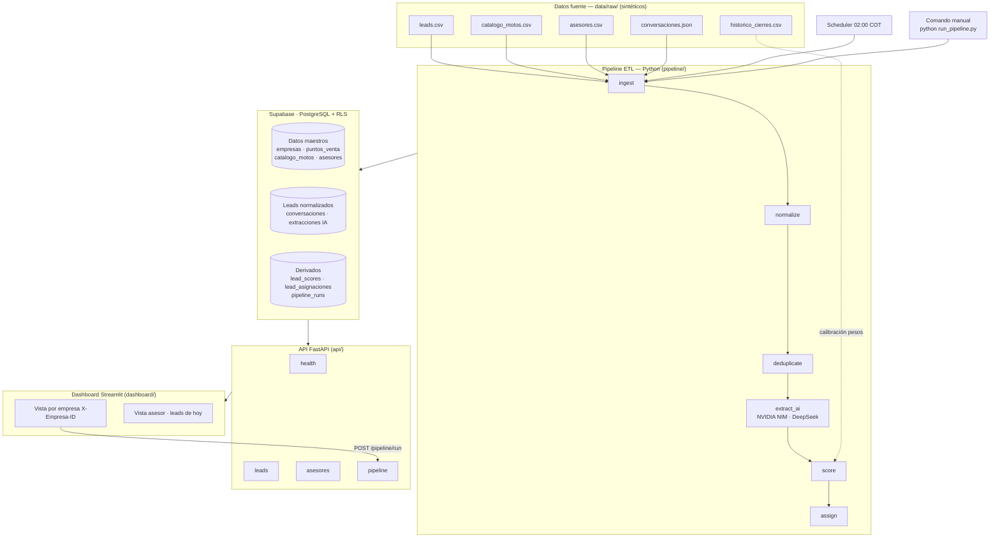
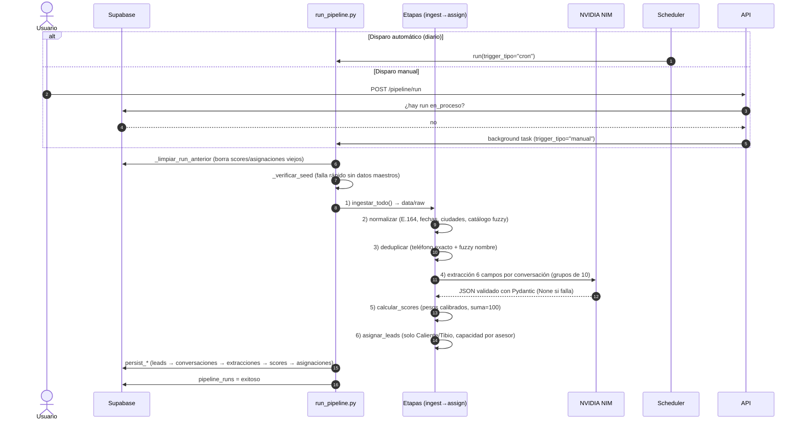
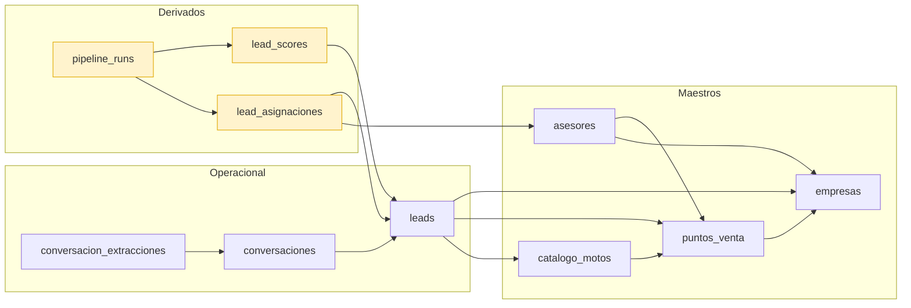
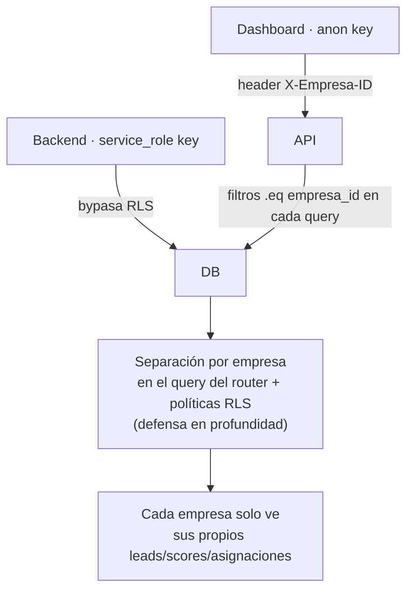

# Arquitectura — Pipeline de Priorización de Leads con IA

Diagramas del sistema en Mermaid (renderizan nativamente en GitHub).

## 1. Vista general del sistema

## 2. Escenarios de ejecución del pipeline

> Nota: en `re_score.py` no se borra nada — `persist_scores`/`persist_asignaciones` hacen **upsert** gracias a los índices únicos de las migraciones 002/003.

## 3. Modelo de datos (flujo de dependencias)

## 4. Separación por empresa (RLS)

